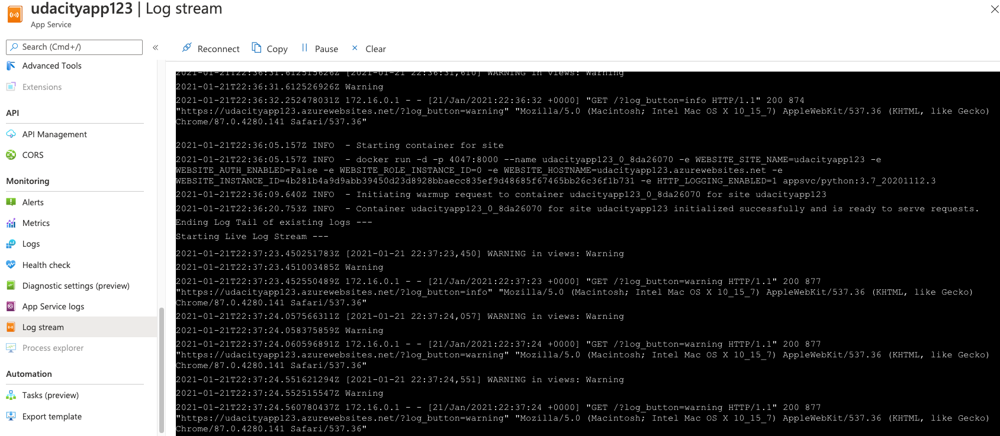

# Monitoring & Logging

In this exercise, you'll add logging to a web app, check out the logs in the Log stream for the
app, create access alerts, and send the logs to a storage account for longer-term storage.

If you load the app on its own, you'll notice that this basic app has four buttons, responding
to four different logging levels - `info`, `warning`, `error` and `critical`. While in a complete
app these would of course be triggered through different events occurring, in your case, you
simply want to make sure Flask is appropriately logging these button presses.

To complete the exercise:
1. You want anything that is a `warning` or above to be logged. Make sure the app's logger is configured for this in `__init__.py`. This means that if the `info` button is clicked, the related request will still be made, but both your local console, and later in Azure, should not note anything for `info` items.
2. Add some logic in `views.py` for logging the correct level when a given button is pressed.
3. Deploy the app as an app service. It may be easiest if you make a new resource group first, so that any additional services you add in the next steps can be easily deleted.
    
    ```bash
    az webapp up --sku F1 -n {YOUR_APP_NAME} --resource-group {YOUR_RESOURCE_GROUP} --location westus2
    ```

4. While waiting for the app to deploy, create a new storage account in the resource group with your app service. Eventually, the logs will be stored here.
5. Once the app has deployed, navigate to the app service in the Azure portal, as well as opening the app URL in a separate window or tab. Navigate to the Log stream for your app, and check whether the logs are appearing appropriately for each button. If not, go back to steps 1 & 2.
6. Go the the Diagnostic settings of your app, and add a setting that send the console logs to the storage account you created in Step 4. This will take around 10 minutes before logs start showing up in the storage account, so continue to the next step.
7. In the Alerts section, create a new alert based on the `Requests` signal for when there are greater than a count of 20 requests in a 15 minute period (set this low so you will be sure to activate it). As part of doing so, create an action group, only including yourself, that will receive an email when the alert is triggered. This may also take roughly 10 minutes to kick in, so go ahead and progress to the next step.
8. While you wait for the storage account to begin receiving logs and the alert to activate, go to the "Quotas" section under "App Service plan" in your app. Take note of the limits, which especially on the free tier are fairly low. If your app exceeds these limits, it will be stopped until the next reset, unless you scale up your app (outside the scope of this course). It's important to note here that all of these quota limitations are available for setting alerts - take a few minutes to consider what type of alerts you might consider setting to become aware of a potential upcoming quota issue.
9. If it's been 10 minutes, go back to your app website and make sure to hit each of the buttons a few times to create additional logs and potentially activate an email alert. Then, go check if your storage container appropriately contains the logs, and if you have received an email alert.

### Outcome: 

