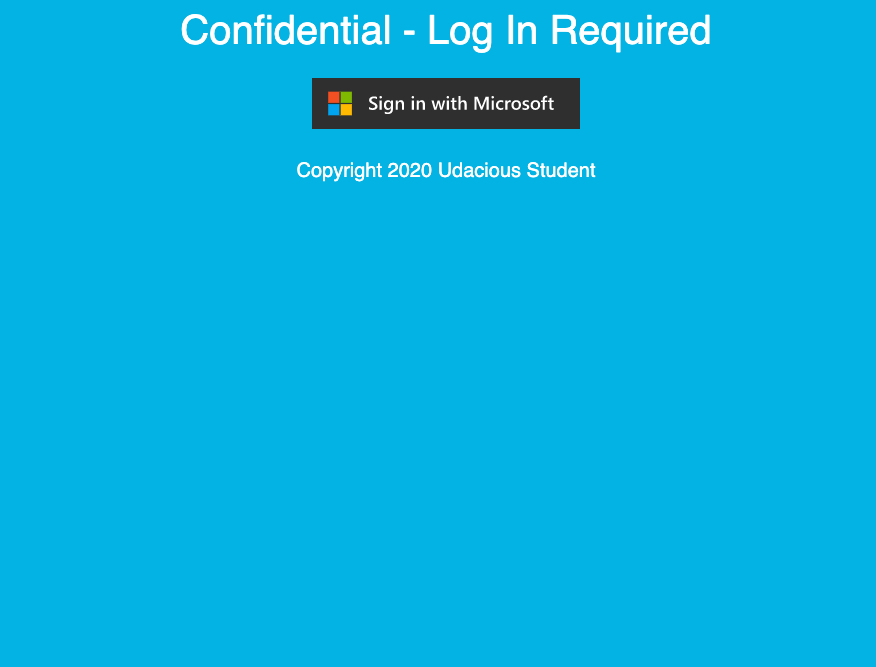
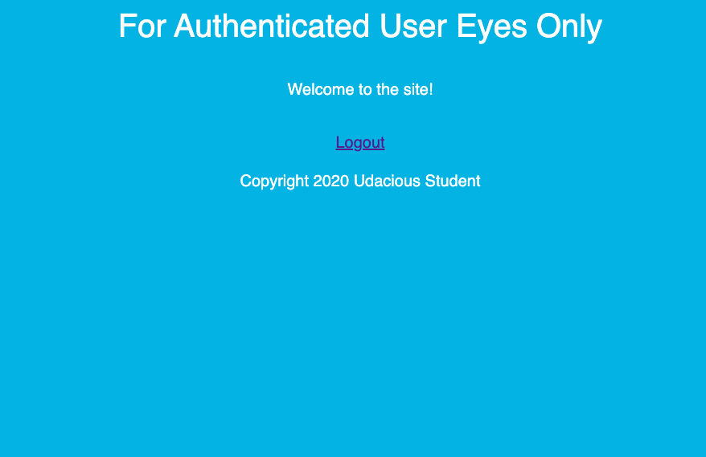

# OAuth2 with MSAL

This exercise will help you get familiar with integrating the Microsoft Authentication Library,
or `msal`, into an application. In the previous exercise, you registered an app with Azure Active
Directory, and you'll use some of the information from there so that authentication can occur.

**Note**: This app will be served on `https` only as Azure AD will block insecure connections for redirect URIs on deployed applications. As such, when testing on `localhost`, make sure to add `https` at the start instead of `http`, e.g. `https://localhost:5555`.

1. You can launch the app, if desired, to start, but you'll notice that it doesn't yet allow you to log in with your Microsoft account. To start, open up `config.py`, and enter in both the client secret and application client ID you previously copied down from Azure AD. If your app is no longer registered, go back through the steps in the previous exercise to obtain new values.
2. You'll also notice a variable for `REDIRECT_PATH`. This should start with a `/`, and then can be whatever else you want it to be (although you should stay away from `/home`, `/login` or `/logout`, since those are used elsewhere in the app). Once you have this set, go back to Azure AD and enter this as the redirect URI for your app, as well as adding a logout URI.
3. Now, you're ready to get started with `msal`. The app code contained in `views.py` currently implements a bit of basic log in and logout with the `Flask-Login` library, but you need to implement the TODOs throughout for the "Sign in with Microsoft" button on the app to work appropriately. The suggested order is as follow:
    - Implement `_build_msal_app` to create a confidential client application
    - Implement `_build_auth_url` to get an authorization request URL
    - Acquire a token from an msal app within the `authorized` function
    - Add the appropriate logout URL to the `logout` function
    
    Together, the above four steps should allow you to have a functional "Sign in with Microsoft" button with the Microsoft Authentication Library, as well as to log back out of the related Microsoft account.
4. Test your app out in localhost (making sure to use `https`), or feel free to deploy the app as well.

### Outcome: 

